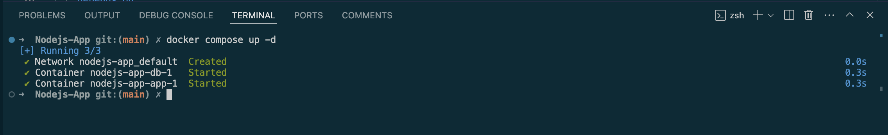
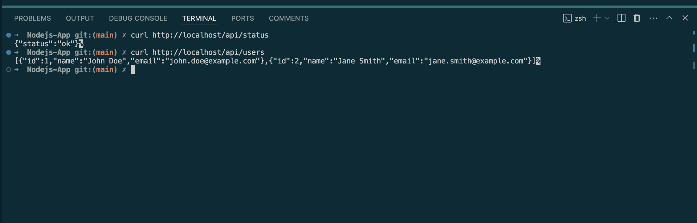

# Node.js and MySQL Docker Application

This project involves setting up a Dockerized Node.js application that connects to a MySQL database. Below are the steps I followed to build, configure, and run the application.

## Step 1: Dockerfile Configuration

I created a Dockerfile to build the image for my Node.js application. The Dockerfile uses the official Node.js version 18 as the base image, which provides a consistent runtime environment for the application.

## Step 2: Docker Compose Configuration

I configured the `docker-compose.yml` file to run both the Node.js application and the MySQL database in separate containers. This setup ensures that the application can interact with the database seamlessly.

### Environment Variables

The following environment variables were set up in the `docker-compose.yml` file to allow the Node.js application to connect to the MySQL database:

```yaml
environment:
  - DB_HOST=db
  - DB_USER=root
  - DB_PASSWORD=${MYSQL_DB_PASSWORD}
  - DB_NAME=${MYSQL_DB_NAME}
```

After creating the Dockerfile and configuring the `docker-compose.yml` file, I successfully built and launched the application by running the `docker-compose up -d` command.



After configuring the environment, I was able to successfully get the application status using the following `curl` command:

Return APP status: 
```curl http://localhost/api/status```

Return User list: 
```curl http://localhost/api/users```


